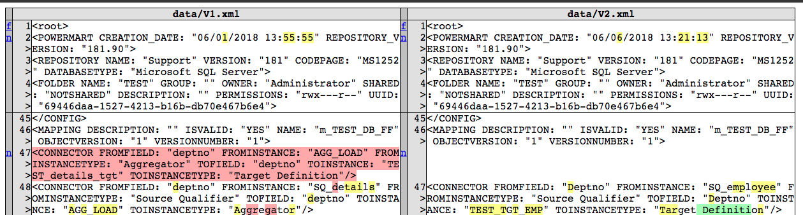
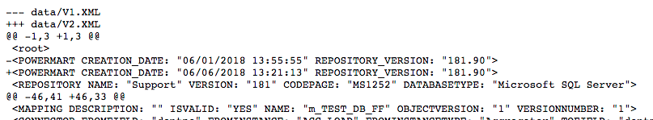
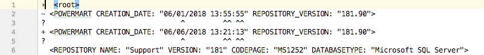
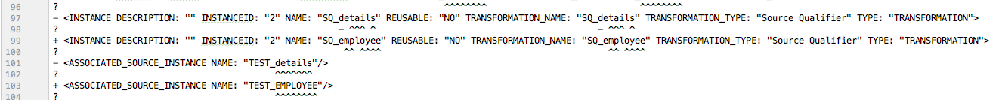
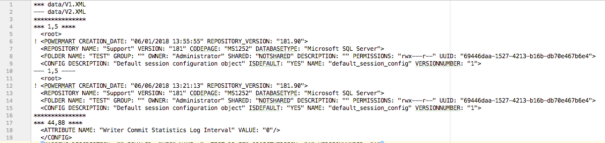

## Powercenter XML Differ

Python program to compare two Informatica Powercenter XMLs and show differences.

## Why & Who

* Powercenter exports Workflow and Mapping in XML format.
* Minor Changes in business logic (adding a new column) changes the XML format at multiple sections.
* Comparing current version and previous version is difficult at times since order of tags differ.
* Developers find it difficult to compare and validate if only intended changes are present in latest case.
* Command line invocating with summary output which can be integrated with CI/CD pipeline to log exact changes.

This utility helps to idenfity exact differences easily by sorting xml tags and uses Python's difflib to match sections of text.
    

### Quick Start

    python src/XMLDiffer.py -m data/V1.xml data/V2.xml > v1_v2_difference.html
    
 Compares V1.xml and V2.xml and generates a HTML page with side by side comparison
 
 

### Usage

    usage: XMLDiffer.py [-h] [-m] [-u] [-n] [-c] [-l L] [-s S] leftfile rightfile

    Python Script to compare two PowerCenter XML Files and display differences.

    positional arguments:
        leftfile    Path to Left File
        rightfile   Path to Right File

    optional arguments:
    
      -h, --help  show this help message and exit
      -m          Produce HTML page containing side-by-side comparison with change highlights
                  (can be used along with -c and -l)
      -u          Produce a unified format. 
                   Show clusters of changes in an inline format
      -n          Produce a ndiff Format. 
                   Show every line and highlights interline changes
      -c          Produce a context format diff.
                   Show clusters of changes in a before/after format
      -l L        Set number of context lines. Applicable for Unified, HTML and Context diff. Defaults to 3
      -s S        Generates a output file named S with summary of differences
    
    Generates HTML output if no optional arguments are passed

### Additional Usage

#### Generate Summary of differences

Genarate a summary of insertions, addition, deletion  in JSON format.

    python src/XMLDiffer.py -m data/V1.xml data/V2.xml -s output/summary.json > v1_v2_difference.html

Content of output/summary.json

    {
        "leftfile_name": "data/V1.xml",
        "rightfile_name": "data/V2.xml",
        "line_count_leftfile": 234,
        "line_count_rightfile": 220,
        "common_lines": 220,
        "deletions_in_leftfile": 0,
        "additons_in_rightfile": 0
    }

#### Unified format.
 
Unified diffs are compact way of showing just the lines changes plus a few lines of context.
The changes are shown in an inline style (instead of separate before/after blocks).

The number of context lines is set by n which defaults to three.

    python src/XMLDiffer.py -u data/V1.XML data/V2.XML -l 2 > output/unified.txt
    
Output is generated in instyle format

#### Ndiff format.
 
Compare files and return output in delta type difference.

    python src/XMLDiffer.py -n data/V1.XML data/V2.XML > output/ndiff.txt
    

#### Context format.
 
Compare files and return output in context diff format.
    
    python src/XMLDiffer.py -c data/V1.XML data/V2.XML > output/cluster.txt
    
